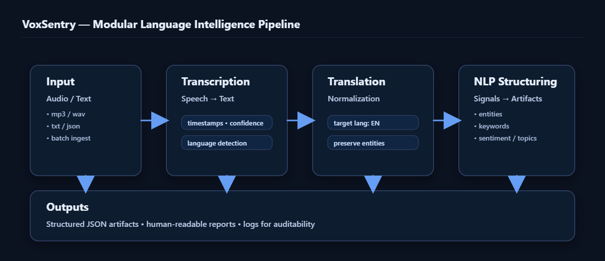

  

VoxSentry

VoxSentry is a modular multilingual language intelligence engine designed to transform raw speech and text into structured, machine-readable analytical artifacts.

🧠 System Architecture

Below is the conceptual architecture model:

                ┌─────────────────────────┐
                │     Input Layer         │
                │  (Audio / Text Files)   │
                └─────────────┬───────────┘
                              │
                              ▼
                ┌─────────────────────────┐
                │  Transcription Engine   │
                │  (Speech → Text)        │
                └─────────────┬───────────┘
                              │
                              ▼
                ┌─────────────────────────┐
                │  Translation Engine     │
                │  (Multilingual Normal.) │
                └─────────────┬───────────┘
                              │
                              ▼
                ┌─────────────────────────┐
                │  NLP Processing Layer   │
                │  Tokenization           │
                │  Entity Detection       │
                │  Semantic Structuring   │
                └─────────────┬───────────┘
                              │
                              ▼
                ┌─────────────────────────┐
                │ Structured Output Layer │
                │  JSON / Text Artifacts  │
                └─────────────────────────┘

Design Goals:

Deterministic pipeline stages

Modular expandability

Language normalization across domains

Clean analytical outputs

📦 Structured Output Schema (Example)

VoxSentry produces structured outputs for downstream analysis.

Example JSON artifact:

{
  "metadata": {
    "source_file": "Arabic.mp3",
    "detected_language": "ar",
    "translation_language": "en",
    "processing_timestamp": "2026-03-02T18:24:00Z"
  },
  "transcription": {
    "original_text": "النص الأصلي هنا",
    "confidence_score": 0.94
  },
  "translation": {
    "translated_text": "The original text here",
    "confidence_score": 0.91
  },
  "semantic_analysis": {
    "entities": [
      {
        "entity": "Cairo",
        "type": "LOCATION",
        "confidence": 0.88
      }
    ],
    "keywords": ["politics", "security", "speech"],
    "sentiment_score": 0.12
  }
}

This structure enables:

Comparative language analysis

Entity cross-referencing

Sentiment profiling

Downstream integration with intelligence dashboards

🎯 Elevation to ISR-Grade Research Tool

VoxSentry is architected for expansion into:

1. Multilingual OSINT Monitoring

Social media ingestion

Cross-language narrative tracking

Sentiment drift detection

2. Cognitive Signal Extraction

Keyword clustering

Topic modeling

Radicalization markers

Narrative influence indicators

3. Cross-Language Correlation

Same-message detection across languages

Translation variance analysis

Semantic similarity scoring

4. Analytical Export Pipelines

JSON → Dashboard ingestion

CSV export for statistical modeling

API endpoint integration

🔒 Operational Design Principles

Local-first processing

No telemetry

Controlled artifact generation

Reproducible analytical outputs

Clear audit trail potential

🚀 Future Development Roadmap

 Language confidence scoring module

 Batch ingestion mode

 Automated semantic clustering

 Entity confidence weighting

 Dashboard integration layer

 Dockerized deployment

 CI validation for translation consistency

🧩 Integration Potential

VoxSentry is designed to integrate with:

Intelligence dashboards

Knowledge graph systems

Investigative data platforms

OSINT automation pipelines